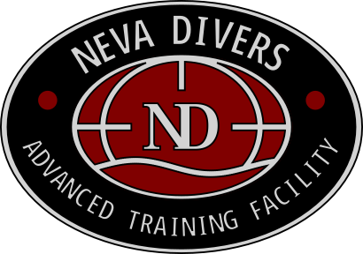

Хранилище моделей логотипов Дайв Центра "Neva Divers"
---

## 🛠️ Как использовать

### 1. Установка OpenSCAD
Скачайте последнюю стабильную версию с [официального сайта](https://openscad.org/downloads.html). Поддерживаются Windows, macOS, Linux.

### 2. Настройка модели
Откройте файл `.scad` и отредактируйте блок переменных в начале:
```openscad
// === ПАРАМЕТРЫ ===
baseWidth            = 50;     // ширина основания, мм
baseLength           = 80;     // высота, мм
thickness            = 4;      // толщина, мм
ovalHoles_enabled    = true;   // тип углублений для ходового линя (по умолчанию овальный)
legHoles_enabled     = true;   // включить/отключить боковые вырезы для линя
cornerRadius         = 2.0;    // радиус скругления углов, мм
edgeRadius           = 0.6;    // радиус 3D‑фаски рёбер, мм
// ========================
```
Нажмите F5 → предпросмотр, F6 → рендер, F7 → экспорт в .svg